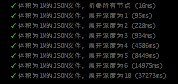

**开发背景：**

项目开发过程中遇到展示json的场景，且json文件体积过大，小则几百kb，也尝试了已经开源的部分组件，但由于节点过多，渲染速度过慢，无法使用，已有项目技术选型为vue，无法再使用react相关技术，所以考虑自己开发一款。

开发过程中参考了react-json-view部分api,组件实现的功能比较基础，但满足基本业务场景，也提供了一些可选配置。

即使加载1M左右的json文时，也能实现快速打开

### 1.查看示例
[在线示例](https://zhaoxuhui1122.github.io/vue-json-view/)

```
git clone  https://github.com/zhaoxuhui1122/vue-json-view.git
npm i
npm run dev

或 直接双击index.html
```


### 2.在项目中使用

```
npm i -S vue-json-views  // 注意是 views
import jsonView from 'vue-json-views'

或

直接将未编译的组件复制到项目内（推荐该方式，便于自定义修改）

```

```
<template>
    <json-view :data="json"/>
</template>

<script>
    import jsonView from '@/components/json-view';

    export default {
        components: {
            jsonView
        },
        data() {
            return {
                json: { /* json data*/ }
            }
        }
    }
</script>
```

**在非工程化的项目内引用**

```html
<!DOCTYPE html>
<html lang="en">
<head>
    <meta charset="UTF-8">
    <meta name="viewport" content="width=device-width, initial-scale=1.0">
    <title>Document</title>
    <script src="https://cdn.jsdelivr.net/npm/vue"></script>
    <script src="build/index.js"></script>
    <style>
        #app{
            height: 400px;
        }
    </style>
</head>
<body>
    <div id="app">
        <json-view :data="json"/>
    </div>
    <script>
        window.onload = function(){
           new Vue({
               el:'#app',
               data(){
                return {
                    json:{}
                }
               },
               components:{
                    jsonView:window['vue-json-view'].default
               }
           })
        }
    </script>
</body>
</html>
```
### 3.可选配置说明

属性 | 说明 | 类型 | 默认值
---|---|---|---
json|传入的json数据（必填）|Object|-
closed|是否折叠全部|Boolean|false
deep|展开深度,越大渲染速度越慢,建议不超过5|Number|3
icon-style|折叠按钮样式，可选值为square、circle、triangle|String|square
icon-color|两个折叠按钮的颜色|Array|theme=vs-code时，['#c6c6c6', '#c6c6c6']，其他情况为['#747983', '#747983']
theme|可选主题样式,可选值为one-dark、vs-code，不选时为默认的白色主题|String|-
font-size|字体大小,单位px|Number|14
line-height|行高，单位px|Number|24

**注：行高和字体大小不建议选用过大值，因为icon大小、每行的padding-left等参数并不会随之发生改变**

### 4.关于二次开发
可根据自己项目的实际情况进行如下开发
- 主题定制：根据需求定制主题，不同的主题名称会给组件定义对应的class名称，根据class重新定义样式即可，可参见项目内的主题配置
- 修改icon样式：项目内icon使用的svg,支持三种样式，可自定义更换或者删除不需要的svg文件，以降低打包体积
- ...

### 更新日志
v1.0.0
- 优化加载速度，实现所有节点展开时也能较快加载
  
  优化前

  优化后
